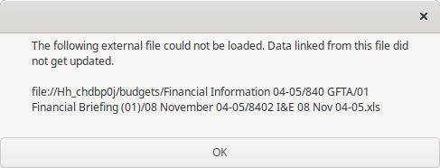

# Excel Expose

This utility will extract cached data from an Excel spreadsheet and create a new spreadsheet document to allow you to view the data.

## How to run

* Clone this repo
* Run `python main.py {path/to/file.xlsx}`
* A file will be created alongside the original in `path/to/file-extracted.xlsx`
* Open this new file in LibreOffice Calc or MS Excel and view the data that was cached within the original

## Background

Excel offers the ability to link one spreadsheet to another, presumably so that you can query data across datasets.

Whilst this can be useful, it has a security impacting side effect.
Data from the linked spreadsheets will often be cached in the local file.
This means that if you then send the file to someone else, you can inadvertently send this cached data too.

There is a clear warning sign that the file you have opened may have some "hidden extras".
When you open the spreadsheet file, you will see a warning similar to this one as shown by LibreOffice Calc:

If you click "Allow Updating", you will likely see another pop-up for each linked spreadsheet showing that it was unable to restore the link:

As you can see from the pop-up, a linked spreadsheet might be one on a shared drive, and it might contain potentially sensitive data.

An Excel spreadsheet (.xlsx) is essentially just a zip file with a specific directory structure.
You can rename the file with a .zip extension, and extract its contents.
If you then navigate to the `xl/externalLinks` files you will see one or more files named like `externalLink1.xml`.
Opening one of these files in a browser or text editor will allow you to see the data that was cached from the linked spreadsheet.

However, trying to read this cached data in its xml form is not very friendly...so let's make it easier.

## What does this tool do?

This is a simple Python script to take a template directory structure for an Excel document, and construct a new file containing data that was cached as external links in your original file.

It loops through each of the `xl/externalLinks/externalLink{N}.xml` files, extracts the `<sheetData>` element, and creates a new `sheet{N}.xml` worksheet in the template.
Some extra steps are needed to convert `<cell/>` nodes to `<c/>` and to build the metadata in the `xl/_rels/workbook.xml.rels` file.

It was created with ChatGPT to automate the process of exposing this data, so apologies for code quality and lack of tests.

## Contact
If you find this useful, let me know and I'll do some work to make it neater to use.
